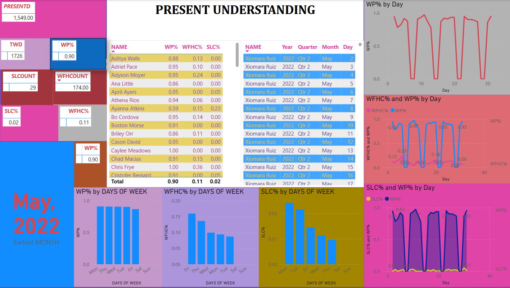

# 📊 Employee HR Analytics Dashboard (Power BI)

This Power BI dashboard provides an insightful visualization of employee attendance metrics—designed to assist HR professionals in understanding trends such as remote work adoption, office presence, and sick leave utilization.



---

## 🚀 Features

- ✅ **Work Percentage (WP%)** tracking per employee
- 🏡 **WFH%** and 💼 **WFO%** (inferred from presence)
- 🤒 **Sick Leave Count (SLC)** and **SLC%**
- 📊 Visual breakdowns by:
  - **Individual employee**
  - **Day of the month**
  - **Day of the week**
  - **Month and Quarter**

- 📈 Combined trend analysis of WP%, WFHC%, and SLC% over time

---

## 🛠 Tools Used

- **Power BI Desktop**
- **DAX** for calculated metrics
- **Custom visuals** and layout design for storytelling

---

## 📂 Project Structure

```plaintext
EMPLOYEE_HR_PBI/
│
├── EMPLOYEE_HR_PBI.pbix       # Power BI report file
├── EMPLOYEE_HR_PBI.png        # Dashboard preview image
└── README.md                  # Project description (this file)
# 📊 Employee HR Analytics Dashboard (Power BI)

This Power BI dashboard provides an insightful visualization of employee attendance metrics—designed to assist HR professionals in understanding trends such as remote work adoption, office presence, and sick leave utilization.


## 🚀 Features

- ✅ **Work Percentage (WP%)** tracking per employee
- 🏡 **WFH%** and 💼 **WFO%** (inferred from presence)
- 🤒 **Sick Leave Count (SLC)** and **SLC%**
- 📊 Visual breakdowns by:
  - **Individual employee**
  - **Day of the month**
  - **Day of the week**
  - **Month and Quarter**

- 📈 Combined trend analysis of WP%, WFHC%, and SLC% over time

## 🛠 Tools Used

- **Power BI Desktop**
- **DAX** for calculated metrics
- **Custom visuals** and layout design for storytelling


## 📂 Project Structure
EMPLOYEE_HR_PBI/
│
├── EMPLOYEE_HR_PBI.pbix       # Power BI report file
├── EMPLOYEE_HR_PBI.png        # Dashboard preview image
└── README.md                  # Project description (this file)
